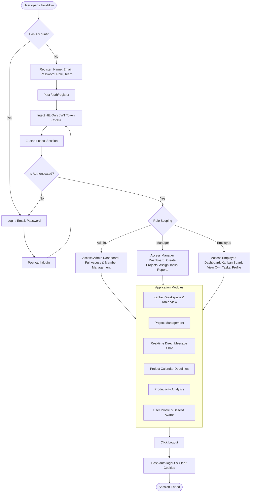

# TaskFlow (Role-Based Task Manager)

TaskFlow is a production-quality enterprise-grade Role-Based Task Management. It is built using the typed MERN stack (MongoDB, Express, React, Node.js, and TypeScript).

## 🚀 Key Features

- **Sequential Employee IDs**: Custom MongoDB pre-save hooks automatically increment employee identifier codes (`EMP-1001` format).
- **HttpOnly Cookie Authentication**: Secure JWT cookies are written and read directly by the server, protecting from XSS token theft.
- **Robust RBAC Middleware**: Strict role-scoped endpoints for **Admin**, **Manager**, and **Employee** roles.
- **Real-Time Integration**: Uses Socket.io to sync chat messages, user typing events, online presence indicators, and task updates.
- **Base64 Photo Uploads**: Direct profile picture file parsing and Base64 database integration.
- **Advanced Productivity Analytics**: Metric charts built using Recharts including Monthly Productivity (Area Chart), Task status splits (Donut), and Team performance ratios.
- **Automated Testing Suite**: Integration tests via Jest & Supertest (backend) and Unit tests via Vitest (frontend).

---

## 🗺️ Architectural Flowchart



---

## ⚙️ Environment Configuration

Create a `.env` file in the `backend/` directory based on the `.env.example` template:

```env
PORT=5000
MONGO_URI=mongodb://127.0.0.1:27017/taskflow
JWT_SECRET=your_super_secret_jwt_key_here
JWT_EXPIRES_IN=7d
```

---

## 📦 Getting Started

### 1. Installation
Install dependencies in both directories:

**Backend:**
```bash
cd backend
npm install
```

**Frontend:**
```bash
cd frontend
npm install
```

### 2. Database Seeding
To populate the database with a clean default Administrator (`admin@taskflow.com` / `admin123`):
```bash
cd backend
npm run seed
```

### 3. Running Development Servers

**Backend server (Port 5000):**
```bash
cd backend
npm run dev
```

**Frontend client (Vite on Port 5173):**
```bash
cd frontend
npm run dev
```

---

## 🧪 Running Automated Tests

To ensure that both backend APIs and global stores function correctly, run the following:

**Backend Jest & Supertest suite:**
```bash
cd backend
npm run test
```

**Frontend Vitest unit testing suite:**
```bash
cd frontend
npm run test
```
